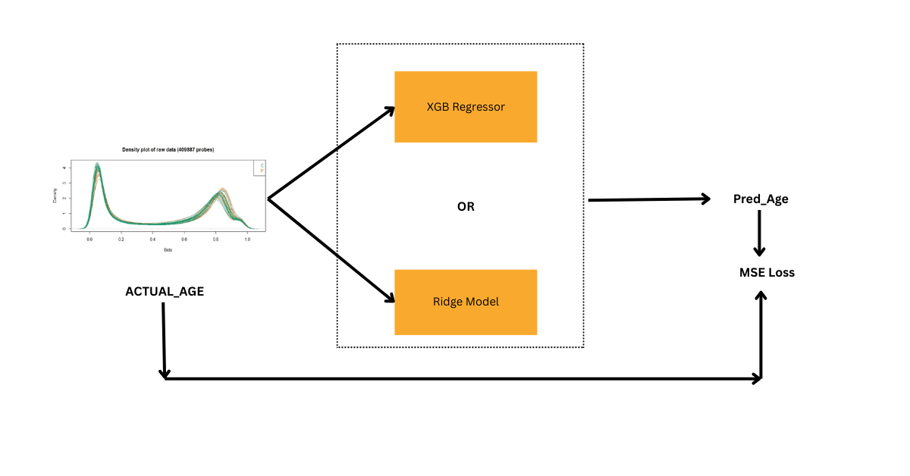
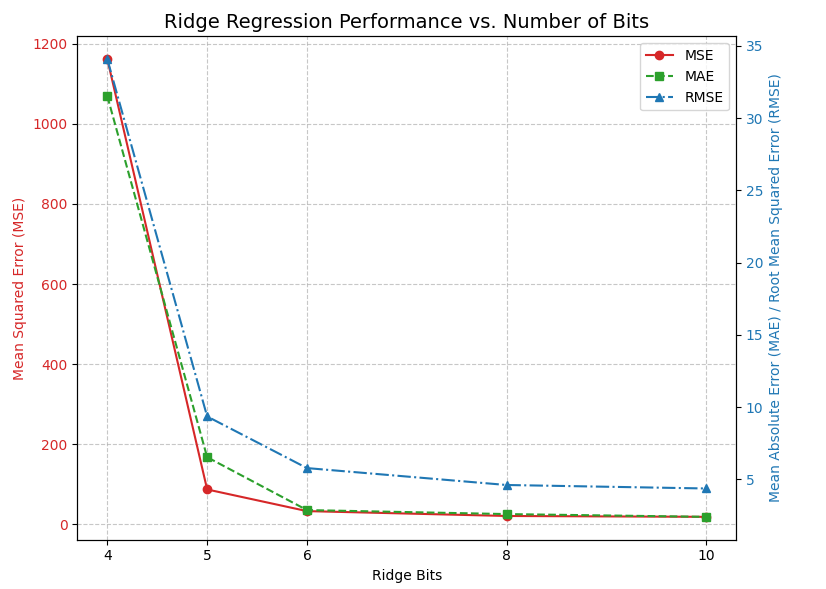

# FHE-BioAge: Privacy-Preserving Biological Age Estimation

## Overview

Chronological age, the number of rotations around the sun, often differs from an individual's **biological age**—the age of their cells. Biological age, influenced by factors beyond genetics, offers a snapshot of current cellular health and is a key indicator of **healthspan**. This project implements a machine learning model for estimating biological age from DNA methylation data, with a critical focus on privacy using **Fully Homomorphic Encryption (FHE)** powered by Zama's Concrete ML.

Our solution allows for biological age prediction on encrypted data, ensuring that sensitive genetic information remains confidential throughout the computation process. This approach paves the way for privacy-preserving health assessments and research.

## Features

*   **FHE-Powered Biological Age Prediction:** Core model (Ridge Regression) operates entirely on encrypted DNA methylation data, ensuring data privacy.
*   **Leverages Concrete ML:** Seamlessly integrates Concrete ML for FHE-compatible model training, quantization, and deployment.
*   **Comprehensive Preprocessing & Diverse Data Sources:** Implements robust preprocessing on clear data, including KNN imputation for missing values and standardization. The model is trained on a rich, combined dataset from numerous public studies utilizing Illumina 27k and 450k arrays (GEO, ArrayExpress, TCGA), ensuring exposure to diverse biological variability.
*   **In-depth Model Evaluation & Trade-off Analysis:** Explored multiple models (Ridge Regression, XGBoost Regressor) and various bit depths (4 to 10 bits for Ridge) to analyze the accuracy vs. FHE-friendliness trade-off. Ridge Regression with 10-bit precision was selected for the final deployment, balancing high accuracy with FHE performance.
*   **Interactive Hugging Face Demo:** A client-server application (https://huggingface.co/spaces/Folefac/concretebiologicalage) deployed as a Hugging Face Space, demonstrating the end-to-end FHE workflow with sample data.
*   **Reproducible Training:** The provided Jupyter notebook details the training process for all explored models.

## Methodology

### 1. Data Source & Preprocessing (Cleartext)

*   **Data Source & Composition:** The models were trained and evaluated on a comprehensive DNA methylation dataset, meticulously compiled from a wide array of publicly available studies. These studies primarily utilized **Illumina's HumanMethylation27 (27k) BeadChip** and **HumanMethylation450 (450k) BeadChip** arrays, which are standard technologies for epigenome-wide association studies.
    The training (`train/combined_train.csv`) and testing (`test/combined_test.csv`) datasets are the result of integrating data from numerous sources, including:
    *   **GEO (Gene Expression Omnibus) Datasets:**
        *   *27k Array:* `GSE27317`, `GSE41037`, `GSE38873`, `GSE15745`, `GSE32393`, `GSE25892`, `GSE20242`, `GSE22595`, `GSE37988`, `GSE17448`, `GSE36642`, `GSE26126`, `GSE34035`, `GSE28746`, `GSE20236`, `GSE19711`, `GSE37008`, `GSE36812`, `GSE34257`, `GSE38608`, `GSE38291`, `GSE36166`, `GSE63384`, `GSE59274`, `GSE57285`, `GSE56606`, `GSE49908`, `GSE49907`, `GSE49905`, `GSE49904`.
        *   *450k Array:* `GSE90124`, `GSE115797`, `GSE99624`, `GSE108213`, `GSE92767`, `GSE69176`, `GSE40360`, `GSE59157`, `GSE42861`, `GSE77241`, `GSE148000`.
    *   **ArrayExpress Datasets:**
        *   *27k Array:* `E-GEOD-43256`, `E-GEOD-64940`, `E-MTAB-2344`, `E-GEOD-62867`, `E-GEOD-44763`, `E-GEOD-48988`, `E-GEOD-58119`, `E-GEOD-58045`, `E-GEOD-57484`, `E-GEOD-54211`, `E-GEOD-56342`, `E-GEOD-27044`, `E-GEOD-36194`, `E-GEOD-21232`, `E-GEOD-32867`, `E-GEOD-30759`, `E-GEOD-30758`, `E-GEOD-32396`, `E-GEOD-31979`, `E-MTAB-625`, `E-MTAB-487`.
        *   *450k Array:* `E-MTAB-2372`, `E-GEOD-73832`, `E-GEOD-71678`, `E-GEOD-71245`, `E-GEOD-83334`, `E-GEOD-75248`, `E-GEOD-77955`, `E-GEOD-67705`, `E-GEOD-77445`, `E-GEOD-79056`, `E-GEOD-72556`, `E-GEOD-52068`, `E-GEOD-74738`, `E-GEOD-76105`, `E-GEOD-65638`, `E-GEOD-71955`, `E-GEOD-63106`, `E-GEOD-73377`, `E-GEOD-56515`, `E-GEOD-73103`, `E-GEOD-67024`, `E-GEOD-72338`, `E-GEOD-59457`, `E-GEOD-64511`, `E-GEOD-64495`, `E-GEOD-59509`, `E-GEOD-67444`, `E-GEOD-62219`, `E-GEOD-51954`, `E-GEOD-52588`, `E-GEOD-36054`, `E-GEOD-50660`, `E-GEOD-61259`, `E-GEOD-61258`, `E-GEOD-61257`, `E-GEOD-61454`, `E-GEOD-61380`, `E-GEOD-61107`, `E-GEOD-54690`, `E-GEOD-49149`, `E-GEOD-55438`, `E-GEOD-53740`, `E-GEOD-57767`, `E-GEOD-49064`, `E-GEOD-50759`, `E-GEOD-56553`, `E-GEOD-54399`, `E-GEOD-53162`, `E-GEOD-53128`, `E-GEOD-50498`, `E-GEOD-47513`, `E-GEOD-49393`, `E-GEOD-39004`, `E-GEOD-51388`, `E-GEOD-51032`, `E-GEOD-48325`, `E-GEOD-44712`, `E-GEOD-45461`, `E-GEOD-40279`, `E-GEOD-41169`, `E-GEOD-32149`, `E-GEOD-41826`, `E-GEOD-42700`, `E-GEOD-32146`, `E-GEOD-30870`, `E-GEOD-34639`, `E-GEOD-63347`, `E-GEOD-59592`.
    *   **TCGA (The Cancer Genome Atlas) Projects:** `TGCA_LUSC`, `TGCA_THCA`, `TGCA_HNSC`, `TGCA_KIRC`, `TGCA_KIRP`, `TGCA_LUAD`, `TGCA_PRAD`, `TGCA_STAD`, `TGCA_COAD`, `TGCA_LIHC`, `TGCA_UCEC`, `TGCA_BRCA`.
    *   The dataset also encompasses samples related to specific conditions or research areas such as **cancer studies** (e.g., `GSE32393`, `E-GEOD-32867`), **reliability assessments** (e.g., `GSE55763`), **rejuvenation research** (e.g., `GSE142439`), and **senescence analysis** (e.g., `GSE91069`).
    This diverse collection ensures the model is exposed to a wide range of biological variability, tissue types, and age groups, contributing to its robustness.
*   **Data Structure:** Each sample in the combined datasets includes patient metadata (`dataset` origin, `tissue_type`, chronological `age`, `gender`) and CpG methylation beta values.
*   **Feature Set Harmonization:** A `gold_standard.csv` file, containing a defined list of CpG sites, is utilized to ensure a consistent feature set across all integrated datasets. This is critical for model training and generalizability.
*   **Imputation:** Due to the heterogeneous nature of combined datasets, missing methylation values are common. These are handled using `KNNImputer`, which imputes missing values based on nearest neighbors in the feature space.
*   **Feature Scaling:** CpG methylation values are standardized using `sklearn.preprocessing.StandardScaler` to have zero mean and unit variance. The mean (`means_train.npy`) and standard deviation (derived from `variance_train.npy`) computed *only* from the training set are saved. These statistics are then applied to scale the validation set, test set, and any new incoming data for prediction. This practice is crucial to prevent data leakage from the test set into the training process and ensures that the model generalizes well to unseen data.
*   **Target Variable:** The chronological 'age' column serves as the target variable for our biological age prediction regression models.

### 2. FHE-Compatible Model Selection & Training (Concrete ML)

*   **Models Explored:**
    *   **Ridge Regression (`Concrete.ml.sklearn.Ridge`):** Chosen as the primary model for its efficiency, good performance on this dataset, and straightforward compatibility with FHE. Explored with 4, 5, 6, 8, and 10 bits of precision.
    *   **XGBoost Regressor (`Concrete.ml.sklearn.XGBRegressor`):** Also evaluated with 6, 8, and 10 bits of precision as a more complex alternative.
*   **Training & Quantization:** Models were trained using Concrete ML, which handles the quantization-aware training or post-training quantization necessary for FHE compatibility. The training process was performed on the preprocessed cleartext data.
*   **Selected Model for Deployment:** **Ridge Regression with 10-bit precision** was selected for the Hugging Face demo due to its superior balance of accuracy (MAE ≈ 2.4 years on test data) and FHE performance characteristics.

### 3. FHE Implementation & Deployment

*   **Concrete ML Deployment Workflow:**
    1.  The trained and FHE-compiled Ridge model (`final_model.compile(X_train)`) is saved using `FHEModelDev`.
    2.  **Client-Side:**
        *   The `FHEModelClient` generates cryptographic keys (private, evaluation).
        *   New input data (e.g., a user's methylation profile) is quantized, encrypted using the private key, and serialized along with the evaluation key.
    3.  **Server-Side (Hugging Face Space Backend):**
        *   The `FHEModelServer` loads the compiled FHE model.
        *   It receives the encrypted data and serialized evaluation key from the client.
        *   Performs the biological age prediction entirely in FHE on the encrypted data.
        *   Returns the encrypted prediction to the client.
    4.  **Client-Side:**
        *   Receives the encrypted result.
        *   Deserializes and decrypts the prediction using the private key to reveal the estimated biological age.
*   **Hugging Face Space:**
    *   This space (https://huggingface.co/spaces/Folefac/concretebiologicalage) demonstrates the end-to-end privacy-preserving prediction pipeline.
## How to Train and Run Inference

*   Go through this colab file (https://colab.research.google.com/drive/1q2s-Xjg0POLNNFLOueqAdB62QrbG-5GU). A link to the dataset is available in the File
  
## How to Run the Hugging Face Demo

1.  Navigate to the deployed Hugging Face Space.
2.  **Upload Data:** Use the "Upload CSV File" button to provide a sample CSV file containing DNA methylation data. The CSV should follow the same column structure as the provided sample data (patient metadata followed by CpG site values).
    *   A sample CSV can be derived from the test set or by creating a file with columns: `dataset,tissue_type,age,gender,cg00000029,cg00000108,...` (refer to `gold_standard.csv` for CpG site names).
3.  **Submit:** Click "Submit" to upload and preprocess the data.
4.  **Generate Keys & Encrypt:** Follow the on-screen buttons to generate cryptographic keys and encrypt your input data locally in your browser.
5.  **Send to Server & Run FHE:** Send the encrypted data and evaluation key to the server for FHE computation.
6.  **Retrieve & Decrypt:** Get the encrypted prediction from the server and decrypt it to see the estimated biological age.

## Performance & Evaluation

*   **Model Accuracy (Ridge Regression, 10-bit precision, on test set samples):**
    *   **Mean Absolute Error (MAE):** Approximately 2.40 years.
    *   **Root Mean Squared Error (RMSE):** Approximately 4.36 years.
    *   (Detailed metrics for all bit depths and models are available in the accompanying report and Jupyter Notebook.)
*   **FHE Performance (Indicative, from development environment):**
    *   **Key Generation Time:** Less than 0.1 seconds.
    *   **FHE Execution Time (per sample, on server):** The deployed Hugging Face Space will provide an FHE execution time for each prediction. This is dependent on the server hardware (typically CPU on HF Spaces) and the complexity of the 10-bit Ridge model. We got ~ 500s for 100 samples for L4 Machine on Colab

## Key Technical Choices & Trade-offs

*   **Model Choice (Ridge vs. XGBoost):** While XGBoost is powerful, Ridge Regression offered a better balance of prediction accuracy and FHE-friendliness (simpler model, potentially faster FHE execution, easier quantization) for this specific dataset and task.
*   **Bit Precision:** We systematically evaluated bit precisions from 4 to 10 bits for Ridge. Increasing bit depth generally improves model accuracy but also increases the complexity and computational cost of FHE operations (larger circuits, longer execution times, larger key sizes). The 10-bit Ridge model was chosen as it provided the best accuracy among the evaluated Ridge configurations without prohibitive FHE overhead for a demo.
  
*   **Preprocessing in Cleartext:** All data imputation and scaling steps are performed on clear data before encryption. This is a common and practical approach in FHE applications, as these operations can be complex or inefficient to perform in FHE. The privacy of the raw input features is maintained as only the preprocessed, scaled data is encrypted.
*   **Concrete ML:** This library significantly simplified the FHE implementation by abstracting away much of the low-level cryptographic complexity, allowing us to focus on the machine learning aspects and FHE trade-offs.

